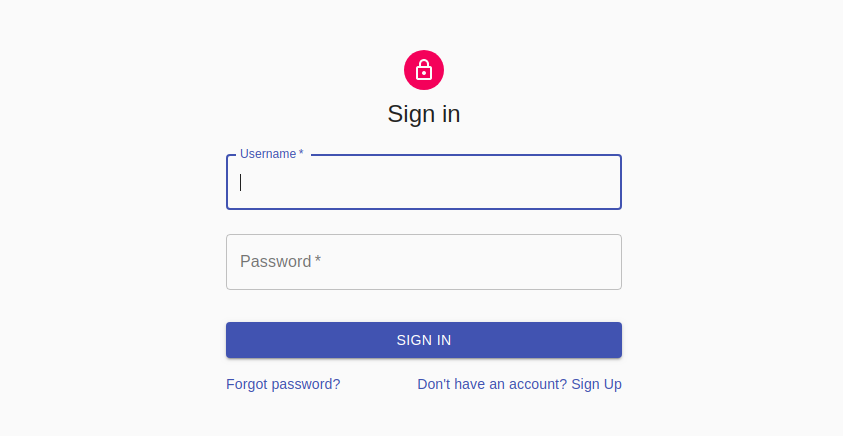
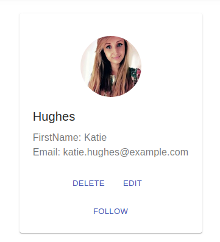
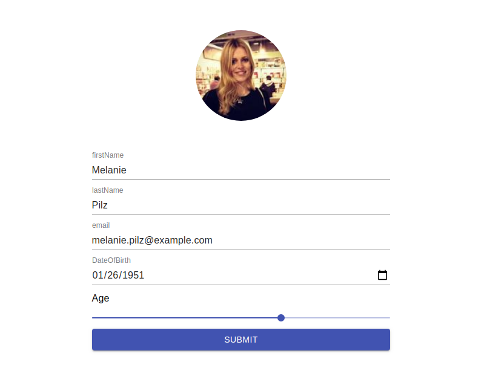
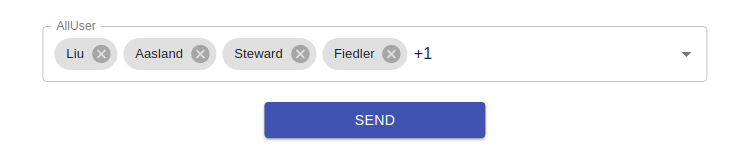

<h1 align="center">Social Network</h1>

<p align="center">


</p>

<h2 align="center">Technologies</h2>

<p align="center">


</p>

<h2>React</h2>
<p>A JavaScript library for building user interfaces</p>

<h2>Next JS</h2>
<p>Next.js gives you the best developer experience with all the features you need for production: hybrid static & server rendering, TypeScript support, smart bundling, route pre-fetching, and more. No config needed.</p>

<h2>Typescript</h2>
<p>TypeScript is an open-source language which builds on JavaScript, one of the world’s most used tools, by adding static type definitions.

Types provide a way to describe the shape of an object, providing better documentation, and allowing TypeScript to validate that your code is working correctly.</p>

<h2>Saga</h2>
<p>Is a library that aims to make application side effects (i.e. asynchronous things like data fetching and impure things like accessing the browser cache) easier to manage, more efficient to execute, easy to test, and better at handling failures.</p>

<h2>Redux</h2>
<p>A Predictable State Container for JS Apps</p>

<h2>Material UI</h2>
<p>React components for faster and easier web development. Build your own design system, or start with Material Design</p>

<h3 align="center">Form Login</h3>



<h3 align="center">Card User</h3>



<h3 align="center">Form Edit Info</h3>



<h3 align="center">Form Add User</h3>




<h3>Project setup</h2>

```
npm install
npm run dev
```


